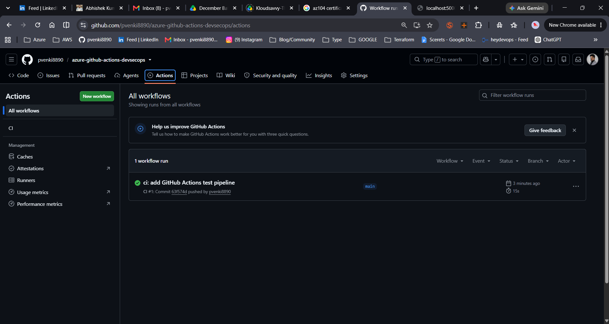
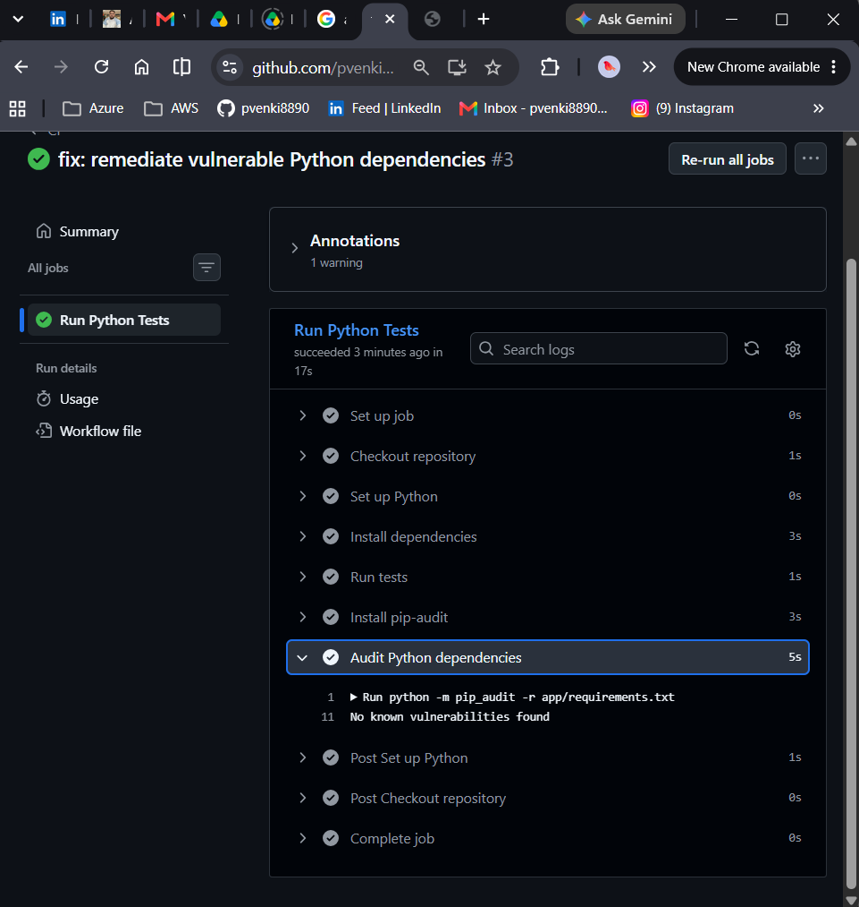
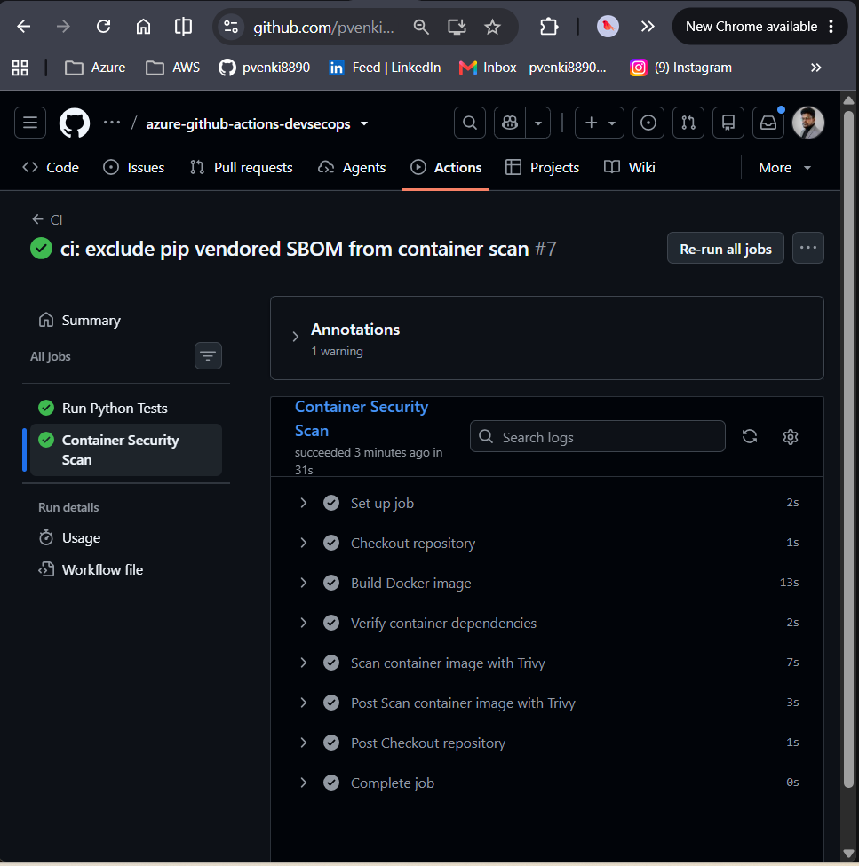
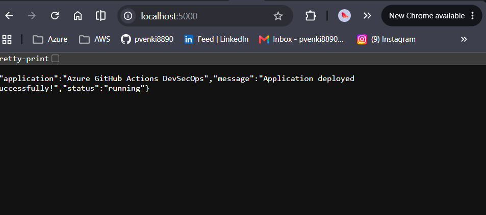

# 🚀 Azure GitHub Actions DevSecOps

> 🔐 End-to-end DevSecOps pipeline for a containerized Python Flask application using GitHub Actions, Docker, Trivy, Azure Container Registry, and Azure Container Apps.

  
  
  
  
  

---

## 🎯 Overview

A practical **DevSecOps implementation** that automates testing, dependency security, container security, Azure authentication, and container image publishing.

### ✨ Highlights

- ⚙️ GitHub Actions CI pipeline triggered on `main`
- 🧪 Automated testing with `pytest`
- 🔎 Dependency vulnerability scanning with `pip-audit`
- 🐳 Docker image security scanning with Trivy
- 🔐 Passwordless Azure authentication using GitHub OIDC
- 🛡️ Azure RBAC with least-privilege `AcrPull`
- 🔑 System-assigned Managed Identity for private ACR access
- 🏷️ Git commit SHA-based container image tagging
- ☁️ Containerized deployment on Azure Container Apps

---

## 🏗️ Architecture

    Developer
        │
        ▼
    GitHub Repository
        │
        ▼
    GitHub Actions
        │
        ├── 🧪 pytest
        ├── 🔎 pip-audit
        ├── 🐳 Docker Build
        └── 🛡️ Trivy Scan
                │
                ▼
        🔐 GitHub OIDC → Azure
                │
                ▼
        📦 Azure Container Registry
                │
             AcrPull
                │
                ▼
        ☁️ Azure Container Apps
                │
                ▼
        🐍 Python Flask Application
             │          │
             ▼          ▼
            `/`      `/health`

---

## ⚙️ CI/CD Pipeline

| Stage | Tool | Purpose |
|:---|:---|:---|
| 🧪 **Test** | pytest | Validate application |
| 🔎 **Dependency Scan** | pip-audit | Detect vulnerable dependencies |
| 🐳 **Build** | Docker | Create container image |
| 🛡️ **Security Scan** | Trivy | Detect HIGH/CRITICAL vulnerabilities |
| 🔐 **Authentication** | GitHub OIDC | Secure Azure authentication |
| 📦 **Registry** | Azure Container Registry | Store container image |
| ☁️ **Runtime** | Azure Container Apps | Run the application |

The container security job runs only after the test job succeeds.

---

## 🛡️ Security

Security controls are integrated directly into the CI/CD workflow.

- 🔎 **pip-audit** scans Python dependencies for known vulnerabilities.
- 🐳 **Trivy** scans the container image and fails the workflow for applicable HIGH/CRITICAL vulnerabilities.
- 🔐 **GitHub OIDC** provides passwordless authentication to Azure without storing long-lived Azure credentials.
- 🔑 **Managed Identity** allows the Container App to authenticate to ACR without registry passwords.
- 🛡️ **Azure RBAC** grants only the required `AcrPull` permission at the registry scope.
- 🏷️ **Git commit SHA tags** provide traceability from source code to container image.
- 🚫 ACR admin authentication is disabled.

---

## ☁️ Azure Infrastructure

| Resource | Configuration |
|:---|:---|
| 📦 **Azure Container Registry** | Basic SKU |
| ☁️ **Container Apps Environment** | Consumption |
| 🚀 **Container App** | `ca-gha-devsecops` |
| 🌏 **Region** | Southeast Asia |
| 📈 **Min / Max Replicas** | `0 / 1` |
| 🔌 **Target Port** | `5000` |
| 🌐 **Ingress** | External |

### Azure Resources

- 📦 `pvgithubdevsecopsacr2026`
- ☁️ `cae-azure-github-actions-devsecops`
- 🚀 `ca-gha-devsecops`

---

## 🐍 Application

A lightweight **Python Flask** application with two endpoints.

### `GET /`

    {
      "application": "Azure GitHub Actions DevSecOps",
      "status": "running",
      "message": "Application deployed successfully!"
    }

### `GET /health`

    {
      "status": "healthy"
    }

✅ Both endpoints were successfully verified against the deployed Azure Container App.

---

## 📸 Implementation Evidence

Selected screenshots provide evidence of the key engineering stages rather than every implementation step.

⚙️ GitHub Actions CI

Successful GitHub Actions workflow demonstrating automated CI execution.

  

🔎 Dependency Security

pip-audit completed successfully with no known vulnerabilities found.

  

🛡️ Container Security

Final Trivy security stage completed successfully after remediation of identified dependency issues.

  

🚀 Application Verification

The application and health endpoints were successfully verified.

Application	Health
	

---

## 📁 Project Structure

azure-github-actions-devsecops/
│
├── .github/
│   └── workflows/
│       └── ci.yml
│
├── app/
│   ├── app.py
│   ├── requirements.txt
│   └── tests/
│
├── docs/
│   └── images/
│       ├── 13-github-actions-ci-success.png
│       ├── 16.png
│       ├── 19.png
│       ├── 07a-application-running.png
│       └── 07b-health-endpoint.png
│
├── Dockerfile
└── README.md

---

## 🧰 Technology Stack

| Category | Technologies |
|:---|:---|
| 🐍 **Application** | Python 3.13, Flask |
| ⚙️ **CI/CD** | GitHub Actions |
| 🔐 **Authentication** | GitHub OIDC |
| 🧪 **Testing** | pytest |
| 🔎 **Dependency Security** | pip-audit |
| 🛡️ **Container Security** | Trivy |
| 🐳 **Containerization** | Docker |
| 📦 **Container Registry** | Azure Container Registry |
| ☁️ **Runtime** | Azure Container Apps |
| 🔑 **Identity** | Azure Managed Identity |
| 🛡️ **Authorization** | Azure RBAC |

---

## 🏆 Result

The completed workflow provides:

Source Code
     ↓
Automated Testing
     ↓
Dependency Security Audit
     ↓
Docker Build
     ↓
Trivy Security Scan
     ↓
GitHub OIDC
     ↓
Azure Container Registry
     ↓
Managed Identity + AcrPull
     ↓
Azure Container Apps
     ↓
Application Verification
Outcome
✅ Automated CI with GitHub Actions
✅ Dependency security validation with pip-audit
✅ Container security scanning with Trivy
✅ Secure, secretless Azure authentication
✅ Least-privilege ACR access
✅ Container image traceability using Git SHA tags
✅ Successful application deployment and endpoint verification

---
